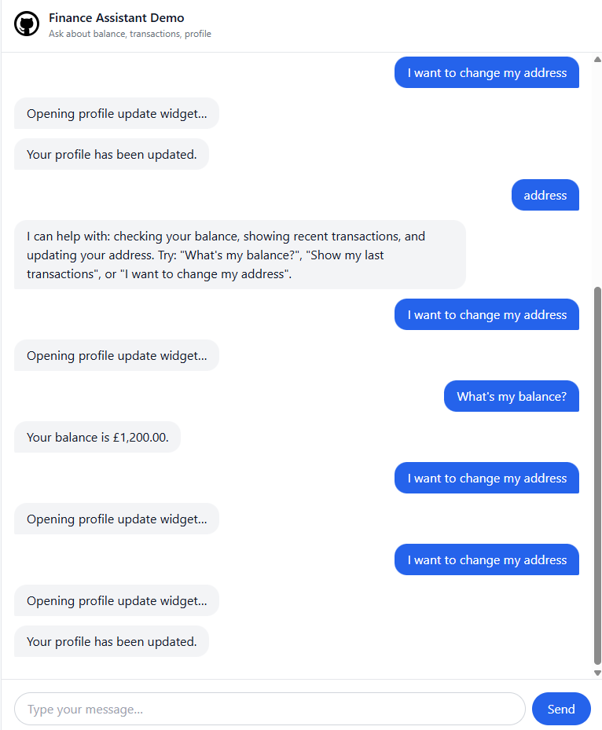

# Finance Assistant Demo

Quick start:

1. Docker (recommended):
   - `docker-compose up --build`
   - Open http://localhost:8080

2. Local dev (optional):
   - Backend: `cd backend && npm install && npm run dev`
   - Frontend: `cd frontend && npm install && npm run dev` then open the printed URL.

